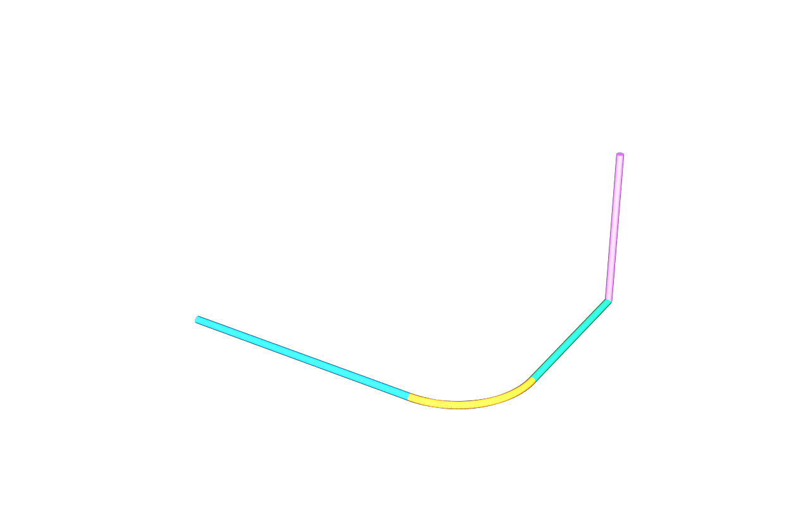

# usdAecoAxis — shared path drivers and derived guide curves

## Use case

Describe a wall, pipe, beam or other path element with local line or circular-arc
drivers. Derive a plan as ordinary USD guide curves. The library adds one
applied API; it adds no referents, identities, geometry types or kind tokens.

## The schema on an index card

| Schema / property | Contract |
|---|---|
| AecoAxisAPI | Single-apply API on Imageable; registered Tf type UsdAecoAxisAxisAPI |
| aeco:axis:start / end | double3, local coordinates in metres; defaults (0,0,0) / (1,0,0) |
| aeco:axis:curve | line or arc; default line |
| aeco:axis:arcPoint | double3 point on the circular arc; default (0,0,0) |
| aeco:axis:length | double, metres; derived, default 0 (unreported) |
| Axis child | BasisCurves, purpose guide, core derived mark, exact or arcSegmented |

The schema block is moved unchanged from core. The new library name changes
its registered Tf name; authored data continues to use `AecoAxisAPI`.

## The example

[Four path elements](examples/minimal/README.md) combine three straight paths
with a quarter-circle bend. The runner authors drivers, derives lengths and
guides, validates through core and axis UsdValidation plugins, and publishes
separate driver, derived and presentation layers.

Open [result/example.usdc](examples/minimal/result/example.usdc) directly with
stock USD: it is flattened, self-contained and includes the AecoFacility →
Xform fallback. The committed [vanilla render](examples/minimal/result/vanilla.png)
is produced with no family plugins. The strokes are schematic; their radius
is a drawing convention. Exact line guides retain `purpose = guide`, and the
32-chord bend declares `arcSegmented` with its measured tolerance.



## Build and check

Use Python 3.11+ with OpenUSD 26.8+, numpy, jinja2, packaging, Pillow and pytest. Put the
matching OpenUSD tools on PATH; `usdrecord` must provide the Embree renderer.
Use toolchain v0.3.10 and core v0.9.4 source checkouts beside this repository,
or set TOOLCHAIN_DIR, CORE_DIR and CORE_PLUGIN_DIR. No package installation
is needed; tests import directly from source. These commands register core's
committed codeless resource plugin directly. CORE_PLUGIN_DIR can also select
a matching built installation.

```sh
export PYTHON=python3
export TOOLCHAIN_DIR="$(cd ../usdaeco-toolchain && pwd)"
export CORE_DIR="$(cd ../usdaeco-core && pwd)"
export CORE_PLUGIN_DIR="$CORE_DIR/usdAeco"
export PYTHONDONTWRITEBYTECODE=1
env -u PYTHONPATH ./build.sh
env -u PYTHONPATH PYTHONPATH="$CORE_DIR:$PWD" "$PYTHON" check.py
env -u PYTHONPATH "$PYTHON" -m pytest -q
env -u PYTHONPATH PYTHONPATH="$CORE_DIR:$PWD" "$PYTHON" examples/minimal/run.py --publish
usdview examples/minimal/result/example.usdc
env -u PYTHONPATH "$PYTHON" tools/aeco_axis.py derive usdAecoAxis/examples/minimal.usda \
  --out out/axis.derived.usda --composed out/run.usda
env -u PYTHONPATH "$PYTHON" tools/aeco_axis.py check out/run.usda
```

`--out` names a dedicated derived layer. Repeating derivation replaces only a
layer owned by this tool. `--composed` optionally creates a **new** root stage
using relative sublayer paths; omit it when regenerating an existing derived
layer. Editors change start/end/curve/arcPoint; they never author length.
`--segments` controls circular-arc segmentation (default 32).
Every guide declares tolerance in metres: a 1e-9 numerical floor for exact
lines, or actual chord deviation for arcs, expanded for point-encoding error.
See the [tolerance contract](usdAecoAxis/userDoc/overview.md) and committed
[derived baseline](testenv/baseline/minimal.derived.usda).

The installed console entry point is `aeco-axis`; the source runner is equivalent.
`check` combines the three registered axis validators with the plan traversal:
every IFC-classified path element with geometry must carry an axis. Warnings
retain their severity; errors make the command fail.

Omit `--publish` for an ordinary example run that writes only `out/`.
`check_example()` compares fresh and committed layers and re-renders the crate
in an isolated process. The gate runs all 29 toolchain structure rules, with
S21–S29 explicitly applied to `examples/minimal`; S20 is inapplicable to a
shared library. The shared harness requires a data-centre v0.4.8 metadata pin,
but this run uses `source.mode = minimal` and does not load that checkout.

For runtime discovery register core first, then `usdAecoAxis` and
`usdAecoAxisValidators`. `check.py` builds `out/plugins/usdAecoAxis/resources`;
`out/plugInfo.json` also discovers its Python validator plugin. The companion
and shared toolchain must be importable for validator execution. Data and guide
curves still compose with no family plugin.

The gate also requires core's Python validators: its core import path above is
intentional. It fails if `usdAecoValidators` cannot load, asserts all eight core
rules loaded, and seeds an E15 warning to prove execution. `aeco-axis check`
selects the axis rules and traversal only; use `check.py` for core conformance.

To check sibling examples against this rebuilt plugin without changing them:

```sh
env -u PYTHONPATH PYTHONPATH="$CORE_DIR" "$PYTHON" tools/check_consumers.py \
  pipe --repo ../usdaeco-pipe
env -u PYTHONPATH PYTHONPATH="$CORE_DIR" "$PYTHON" tools/check_consumers.py \
  wall --repo ../usdaeco-wall
```

The runner reports untouched and temporarily rederived stages separately and
fails on any remaining derived-stage finding. Consumer checks are optional;
this release verifies the axis example and schema.

```sh
nix flake check --no-write-lock-file
```

Public flake URLs match the exact refs in `dependencies.json`; `library.json`
requires core `>=0.9.2,<1.0`. For a local source service use the registry file or
`--override-input` mapping described in the
[toolchain README](https://github.com/criad-com/usdaeco-toolchain#build-and-check).
Repeat overrides for transitive inputs. Keep deployment lockfiles uncommitted.
Core and datacentre are source inputs (`flake = false`); the shared toolchain
builds the core plugin and its companion packages. The toolchain's nested
family inputs select aeco-toolchain v0.4.0 and its core v0.9.2 test fixture.
See [release verification](docs/toolchain-pin-verification.md) for the one-attempt Nix result.

## Family

`usdaeco-axis` is a shared section-tier library depending only on `usdAeco`.
Path-based wall and pipe libraries depend on axis. Core and representation-first
exact geometry do not require it. See the
[core design model](https://github.com/criad-com/usdaeco-core/blob/main/docs/03-design-model.md)
and [use-case contract](docs/usecase.md).

## Layout

| Path | Contents |
|---|---|
| usdAecoAxis/ | Flat schema, generated resource plugin, userDoc and minimal source |
| usdAecoAxisValidators/ | Three Python UsdValidation rules |
| tools/usdaeco_axis/ | Queries, axis math, derivation and traversal CLI |
| testenv/ | Schema, validator, derivation and source-preservation tests; render camera |
| examples/minimal/ | Runnable four-axis example, expected findings and committed standalone result |
| conformance/profiles/axis.json | Validator keyword and default severities |
| out/ | Ignored install, derived layers and verification output |

## Status

Version 0.1.5: **54 checks, 0 failed, 0 not run; 21 tests passed**, plus 5 subtests.
This release selects public tags for toolchain v0.3.10, core v0.9.4 and
datacentre v0.4.8. S05 checks tag-only family refs and package-version agreement.
The schema source and
generated schema are unchanged from v0.1.1.
Checked source revisions are recorded beside the tags in `dependencies.json`.
The unchanged derivation retains its v0.1.3 producer stamp so this release
preserves the crate, five archived layers and committed renders byte-for-byte.
The example was republished; its manifest and result README record the new
pins. Fresh renders pass S28; the existing images are retained because sampled
render bytes vary between runs.
See [release verification](docs/toolchain-pin-verification.md) for measured results and limitations.
This tool derives guide geometry; body
regeneration, section solving and native host transactions belong to their owners.

## Licence

[MIT](LICENSE). Copyright (c) 2026 Criad.

No third-party code is vendored. Runtime dependencies keep their own licences:
OpenUSD uses its Apache-2.0-style TOST licence; numpy and jinja2 use BSD licences;
packaging uses Apache-2.0 or BSD-2-Clause; Pillow uses HPND; the shared
usdaeco-toolchain and usdAeco core use MIT. The test dependency pytest uses MIT.
