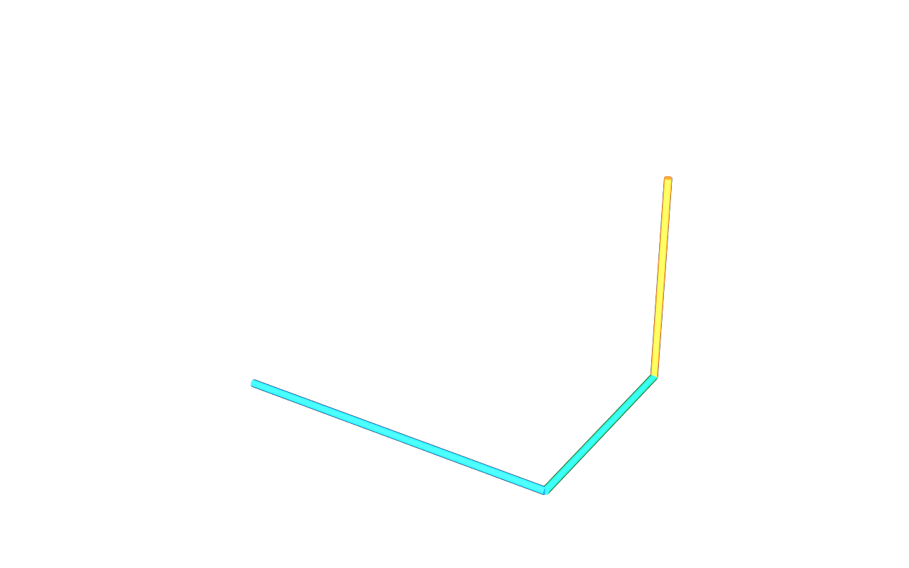

# usdAecoAxis

A shared applied API provides local-space line and circular-arc drivers on
Imageable prims. Identity and classification remain in core; no new referent
or geometry type is introduced. The [minimal run](../examples/minimal.usda)
contains three classified pipe segments and only driver opinions.

`aeco-axis derive` creates a separate layer with three `BasisCurves "Axis"`
children and derived lengths of 3, 2 and 2 metres. The curves have guide purpose
and the core representation mark. Enable guide purpose in a stock USD viewer.

Every guide authors `aeco:derived:tolerance` in metres. For an `exact` line,
the derivation precision of double-precision endpoints is **1e-9 m**. If
encoding its points as float32 introduces a larger error, that measured error
sets the tolerance. For `arcSegmented`, the chord deviation is
`r * (1 - cos(abs(sweep) / (2 * segments)))`, evaluated as
`2 * r * sin(abs(sweep) / (4 * segments))²` to avoid cancellation.
The authored tolerance is the chord deviation plus maximum point-encoding
error, with a 1e-9 m floor. It is never zero and remains in metres when the
stage's geometry units change. Length is still evaluated analytically.

The committed [minimal derived layer](../../testenv/baseline/minimal.derived.usda)
has three exact guides, each declaring 1e-9 m. Compose it over the driver
example; it contains only derived opinions. The gate compares freshly derived
output with this baseline and runs both core and axis validators.

The image is rendered from freshly derived output. Embree supports mesh rprims
only, so the illustration adds temporary Cylinder proxy strokes along the
derived line points. Their 0.035 m radius is a drawing convention, not pipe
section data. The production output remains exactly three BasisCurves.
The [use-case document](../../docs/usecase.md) explains validation and ownership.
The schema block is extracted unchanged from core v0.8.4; its old B9 reference
now means this library's traversal contract. The registered Tf type is
`UsdAecoAxisAxisAPI`, while authored stages use `AecoAxisAPI`.
